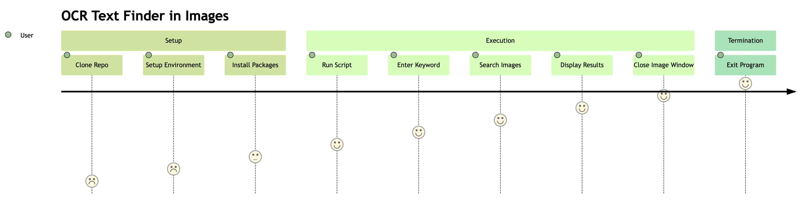

 

Languages: [English](README.md) | [中文](translations/README-zh.md)

# OCR Text Finder in Images

> The initial reason for writing this program was that I was the network administrator of my department, and I had to conduct an asset inventory due to a change in department leadership.
>
> Consequently, there were as many as 166 items to inventory. Therefore, each time I found an item and needed to attach a new sticker, I had to search for that item's sticker from all the asset stickers.
>
> However, these stickers were not sorted according to any specific rule, so it took a long time to find the stickers each time.
> Thus, this program was designed to search for the location of an asset sticker in which image and at what position.

OCR Image Keyword Search is an efficient and user-friendly Python application that utilizes **Optical Character Recognition (OCR)** to search for user-specified keywords in a set of images. The application uses the Tesseract OCR engine and OpenCV for image processing, and stores OCR results for faster subsequent searches.

## User Journey Diagram



## Prerequisites

Before you begin, ensure you have met the following requirements:

- Python 3.6 or later.
- [Tesseract OCR](https://github.com/tesseract-ocr/tesseract) installed on your machine.

  For **Windows** users, you can download the installer from the [UB Mannheim Github page](https://github.com/UB-Mannheim/tesseract/wiki) and follow the installation instructions.

  For **Mac** users, you can install Tesseract using Homebrew:

  ```bash
  brew install tesseract
  ```

  For **Linux** users, you can install Tesseract using apt:

  ```bash
  sudo apt install tesseract-ocr
  ```

## Installation

1. Clone this repository to your local machine.

   ```bash
   git clone https://github.com/xxrjun/text-finder-in-images.git
   ```

2. Set up a virtual environment (optional, but recommended):

   ```bash
   python3 -m venv venv
   ```

3. Activate the virtual environment:

   ```bash
   source venv/bin/activate
   ```

4. Install the required Python packages:

   ```bash
   pip install -r requirements.txt
   ```

## Usage

1. Place the images you want to search in the `./images` directory.
2. Modify the `main.py` file to set the path to the Tesseract OCR executable(in line 8):

   ```python
   # TODO: Set the path to the Tesseract OCR executable
   pytesseract.pytesseract.tesseract_cmd = r'/opt/homebrew/bin/tesseract'
   ```

   How to find the path to the Tesseract OCR executable: [Tesseract documentation: Installation](https://tesseract-ocr.github.io/tessdoc/Installation.html)

3. Run the main script:

   ```bash
   python main.py
   ```

4. When prompted, enter the keyword you want to search for. The program will search for the keyword in the images and display any images where the keyword is found. Press 'q' to close the image window and continue with the next image.

5. To exit the program, enter 'exit' when prompted for a keyword.
