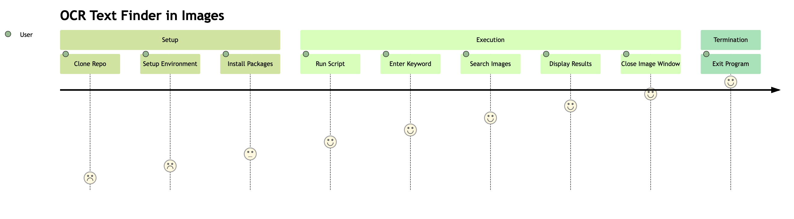

 

語言: [英文](../README.md) | [中文](translations/README-zh.md)

# 圖片中的 OCR 文字搜尋器 (OCR Text Finder in Images)

> 一開始撰寫此程式的目的是因為我是系所的網管，要做財產盤點，剛好遇上系上所長更換。
>
> 所以要盤點的財產多達 166 項，因此我每次找到一項財產要貼上新的貼紙時，都需要從所有財產貼紙中尋找該財產的貼紙。
>
> 然而，這些貼紙並沒有依照特定規則排序，所以每次尋找貼紙都找非常久。
> 故設計此程式來搜尋財產貼紙在哪一張圖片中的哪一個位置。

OCR 圖片關鍵字搜尋是一款高效且使用者友善的 Python 應用程式，利用 **光學字符識別(OCR)** 在一組圖片中搜尋使用者指定的關鍵字。該應用程式使用 Tesseract OCR 引擎和 OpenCV 進行圖像處理，並儲存 OCR 結果以加快後續搜尋的速度。

## 使用者流程圖 (User Journey Diagram)



## 預備條件 (Prerequisites)

在開始之前，請確保您已經滿足以下的要求：

- Python 3.6 或更高版本。
- 您的機器上已安裝[Tesseract OCR](https://github.com/tesseract-ocr/tesseract)。

  對於**Windows**用戶，您可以從[UB Mannheim Github 頁面](https://github.com/UB-Mannheim/tesseract/wiki)下載安裝程序，並按照安裝指南進行操作。

  對於**Mac**用戶，您可以使用 Homebrew 安裝 Tesseract：

  ```bash
  brew install tesseract
  ```

  對於**Linux**用戶，您可以使用 apt 安裝 Tesseract：

  ```bash
  sudo apt install tesseract-ocr
  ```

## 安裝 (Installation)

1. 克隆此存儲庫到您的本地機器。

   ```bash
   git clone https://github.com/xxrjun/text-finder-in-images.git
   ```

2. 設置虛擬環境（可選，但建議）：

   ```bash
   python3 -m venv venv
   ```

3. 啟動虛擬環境：

   ```bash
   source venv/bin/activate
   ```

4. 安裝所需的 Python 套件：

   ```bash
   pip install -r requirements.txt
   ```

## 使用 (Usage)

1. 將您想要搜尋的圖片放在 `./images` 目錄中。
2. 修改 `main.py` 文件以設定 Tesseract OCR 可執行文件的路徑（在第 8 行）：

   ```python
   # TODO: 設定Tesseract OCR可執行文件的路徑
   pytesseract.pytesseract.tesseract_cmd = r'/opt/homebrew/bin/tesseract'
   ```

   如何找到 Tesseract OCR 可執行文件的路徑：[Tesseract 文檔：安裝](https://tesseract-ocr.github.io/tessdoc/Installation.html)

3. 運行主要的腳本：

   ```bash
   python main.py
   ```

4. 當提示輸入您想搜尋的關鍵字時，輸入即可。該程式會在圖片中尋找該關鍵字並展示找到關鍵字的圖片。按 'q' 可以關閉圖片視窗並繼續下一張圖片。

5. 若要退出程式，在提示輸入關鍵字時輸入 'exit'。
